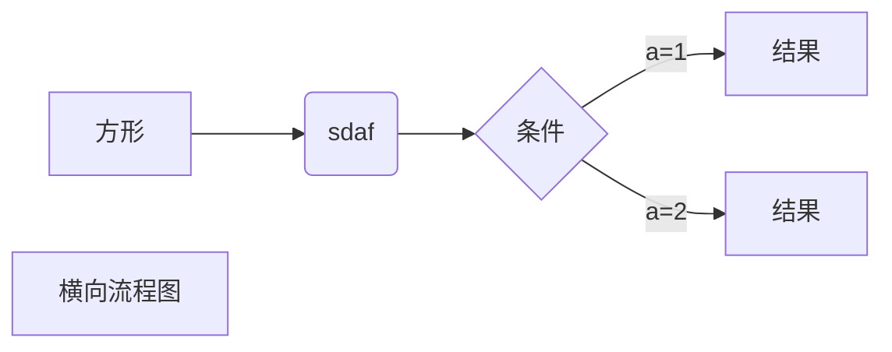
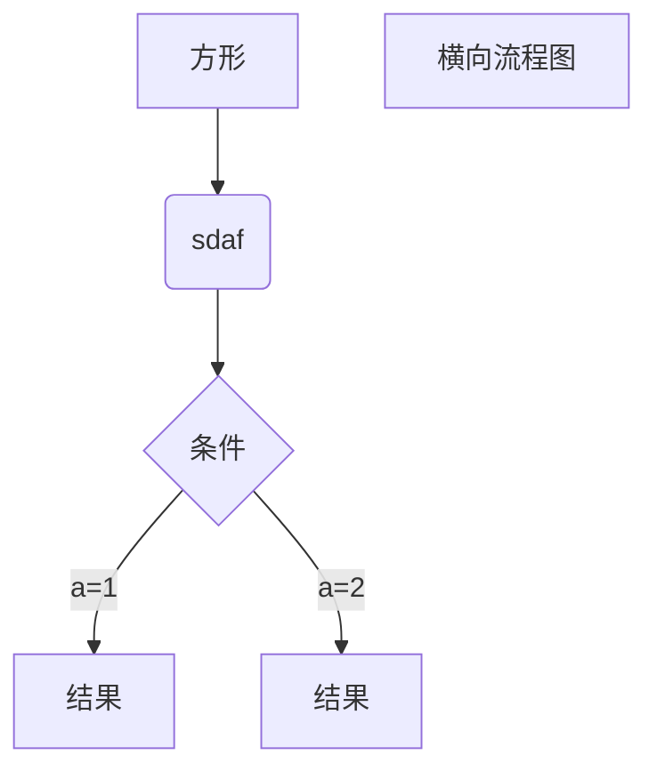
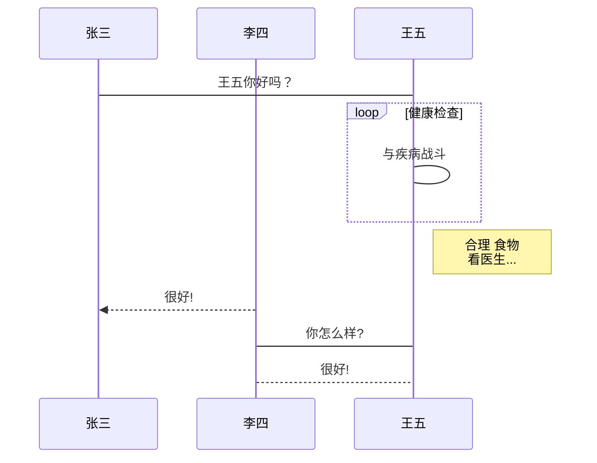
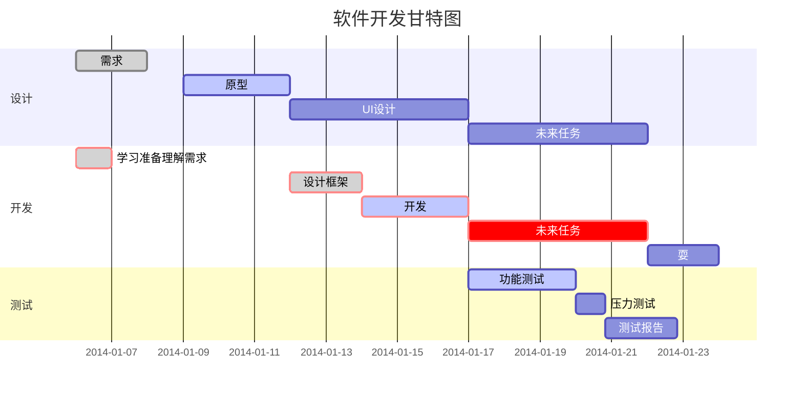

#### markdown语法

###### 1:标题


# 一级标题
## 二级标题 
### 三级标题
#### 四级标题
##### 五级标题
###### 六级标题

```
# 一级标题
## 二级标题 
### 三级标题
#### 四级标题
##### 五级标题
###### 六级标题
```

###### 2：段落

换行，末尾添加两个空格就是换行

markdown  

markdown

markdown

字体

*斜体文本*
_斜体文本_
**粗体文本**
__粗体文本__
***粗斜体文本***
___粗斜体文本___

```
*斜体文本*
_斜体文本_
**粗体文本**
__粗体文本__
***粗斜体文本***
___粗斜体文本___
```


 分割线

1
***
2
* * *
3
*****
4
- - -
5

---
6

---------------


```
1
***
2
* * *
3
*****
4
- - -
5

---
6

---------------
```


删除线

markdown
~~markdown~~
```
~~markdown~~
```

<u>下划线</u>
```
<u>下划线</u>
```


斜体和黑体字

<b>markdown</b>
<i>markdown</i>


```
<b>markdown</b>
<i>markdown</i>
```


脚注[^markdown]
[^markdown]: www.baidu.com


```
添加脚注并添加链接的方法
脚注[^markdown]
[^markdown]:
www.baidu.com
```


##### 列表

+ 1 
+ 2
+ 3
+ 4

* 1
* 2
* 3
* 4

- 1
- 2
- 3
- 4

1. q
2. w
3. e
4. r

```
普通列表
+ 1 
+ 2
+ 3
+ 4

* 1
* 2
* 3
* 4

- 1
- 2
- 3
- 4
带序号列表
1. q
2. w
3. e
4. r

```

#### 列表嵌套

1. 第一项：
	- 第一个
	- 第二个

2. 第二项：
	- 第一个
	
	- 第二个
		- 第三
		- 第五
		
```
1. 第一项：
	- 第一个
	- 第二个

2. 第二项：
	- 第一个
	- 第二个
		- 第三
		- 第五
```


#### 区块

> 第一层
> > 第二层
> >
> > > 第三层

> 区块中使用列表
> 1. 第一项
> 2. 第二项
> + 第一项
> + 第二项
> + 第三项

* 第一项
    > 菜鸟教程
    > 学的不仅是技术更是梦想  
    
* 第二项

    


```
#### 区块

> 第一层
>
> > 第二层
> >
> > > 第三层

> 区块中使用列表
>
> 1. 第一项
> 2. 第二项
>
> + 第一项
> + 第二项
> + 第三项

* 第一项

  > 菜鸟教程
  > 学的不仅是技术更是梦想  

* 第二项
```

函数引用

````
` `引用一段代码

引用一个代码块
```
```
````

`printf()`函数


````
可以包裹一段代码，并且指定语言

```
```
````


#### 链接

 [百度](www.baidu.com)
这是一个链接[菜鸟教程](https://www.runoob.com)

```
两种隐藏添加链接的方式：
[百度](www.baidu.com)
这是一个链接[菜鸟教程](https://www.runoob.com)
```

直接将链接添加出来
<www.baidu.com>
www.baidu.com


引用添加链接

这个链接用 1 作为网址变量 [Google][1]
这个链接用 runoob 作为网址变量 [Runoob][runoob]
然后在文档的结尾为变量赋值（网址）

[1]: http://www.google.com/
[runoob]: http://www.runoob.com/

```
这个链接用 1 作为网址变量 [Google][1]
这个链接用 runoob 作为网址变量 [Runoob][runoob]
然后在文档的结尾为变量赋值（网址）
[1]: http://www.google.com/
[runoob]: http://www.runoob.com/
```


#### 图片


```
引用在线的图片，可以制作一个图床

```

```
引用本地图片，分享的时候笔记麻烦，上传GitHub之类的平台可以使用相对路径

```


```
使用HTML语法可以修改图片大小

```


|  表头   | 表头  |
|  ----  | ----  |
| 单元格  | 单元格 |
| 单元格  | 单元格 |

```
|  表头   | 表头  |
|  ----  | ----  |
| 单元格  | 单元格 |
| 单元格  | 单元格 |
```

| 左对齐 | 右对齐 | 居中对齐 |
| :-----| ----: | :----: |
| 单元格 | 单元格 | 单元格 |
| 单元格 | 单元格 | 单元格 |
```python
| 左对齐 | 右对齐 | 居中对齐 |
| :-----| ----: | :----: |       # 注意此处
| 单元格 | 单元格 | 单元格 |
| 单元格 | 单元格 | 单元格 |
```


#### 数学公式

插入数学公式，可以使用两个美元符号$$来包裹TeX或LaTex格式的数学公式来实现

$$
\mathbf{V}_1 \times \mathbf{V}_2 =  \begin{vmatrix} 
\mathbf{i} & \mathbf{j} & \mathbf{k} \\
\frac{\partial X}{\partial u} &  \frac{\partial Y}{\partial u} & 0 \\
\frac{\partial X}{\partial v} &  \frac{\partial Y}{\partial v} & 0 \\
\end{vmatrix}
${$tep1}{\style{visibility:hidden}{(x+1)(x+1)}}
$$


`现在需求不大，具体实现方式学习后补充`

#### 流程图



```
横向流程图
graph LR
A[方形] -->B(sdaf) -->C{条件}
C-->|a=1| D[结果]
C-->|a=2| E[结果]
F[横向流程图]
```




```
横向流程图
graph TD
A[方形] -->B(sdaf) -->C{条件}
C-->|a=1| D[结果]
C-->|a=2| E[结果]
F[竖向流程图]
```


````flow
st=>start: 开始框
op=>operation: 处理框
cond=>condition: 判断框(是或否?)
sub1=>subroutine: 子流程
io=>inputoutput: 输入输出框
e=>end: 结束框
st->op->cond
cond(yes)->io->e
cond(no)->sub1(right)->op
````
```
````flow
st=>start: 开始框
op=>operation: 处理框
cond=>condition: 判断框(是或否?)
sub1=>subroutine: 子流程
io=>inputoutput: 输入输出框
e=>end: 结束框
st->op->cond
cond(yes)->io->e
cond(no)->sub1(right)->op
```


##### UML时序图源码

```sequence

对象A->对象B: 对象B你好吗?（请求）
Note right of 对象B: 对象B的描述
Note left of 对象A: 对象A的描述(提示)
对象B-->对象A: 我很好(响应)
对象A->对象B: 你真的好吗？

```

````
```sequence
对象A->对象B: 对象B你好吗?（请求）
Note right of 对象B: 对象B的描述
Note left of 对象A: 对象A的描述(提示)
对象B-->对象A: 我很好(响应)
对象A->对象B: 你真的好吗？
```
````


##### UML时序图源码复杂样例


```sequence
Title: 标题：复杂使用
对象A->对象B: 对象B你好吗?（请求）
Note right of 对象B: 对象B的描述
Note left of 对象A: 对象A的描述(提示)
对象B-->对象A: 我很好(响应)
对象B->小三: 你好吗
小三-->>对象A: 对象B找我了
对象A->对象B: 你真的好吗？
Note over 小三,对象B: 我们是朋友
participant C
Note right of C: 没人陪我玩
```

````
```sequence
Title: 标题：复杂使用
对象A->对象B: 对象B你好吗?（请求）
Note right of 对象B: 对象B的描述
Note left of 对象A: 对象A的描述(提示)
对象B-->对象A: 我很好(响应)
对象B->小三: 你好吗
小三-->>对象A: 对象B找我了
对象A->对象B: 你真的好吗？
Note over 小三,对象B: 我们是朋友
participant C
Note right of C: 没人陪我玩
```
````



````

````


##### 甘特图样例



```


