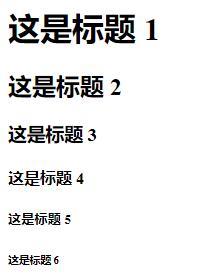
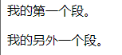
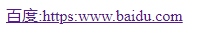

# HTML基础

##### 基本格式


- **<!DOCTYPE html>** 声明为 HTML5 文档
- **<html>** 元素是 HTML 页面的根元素
- **<head>** 元素包含了文档的元（meta）数据，如 **<meta charset="utf-8">** 定义网页编码格式为 **utf-8**。
- **<title>** 元素描述了文档的标题
- **<body>** 元素包含了可见的页面内容
- **<h1>** 元素定义一个大标题
- **<p>** 元素定义一个段落


##### 标题

```html
html通过<p> </p>来定义标题
<h1>这是标题 1</h1>
<h2>这是标题 2</h2>
<h3>这是标题 3</h3>
<h4>这是标题 4</h4>
<h5>这是标题 5</h5>
<h6>这是标题 6</h6>
```

效果图


##### 段落

```html
<p>这是一个段落。</p>
<p>这是另外一个段落。</p>
```

效果图

##### 链接

```html
href属性中指定链接的地址，在两个标签中为所要显示的内容
<a href = "https:www.baidu.com">百度:https:www.baidu.com</a>
```

效果图


##### 图片

```html
 标签定义HTML的图像
  # scr="这里填地址，可以为相对地址，最好为图床的地址"
  # width和height可以限制大小
```


#### HTML元素语法

- HTML 元素以**开始标签**起始
- HTML 元素以**结束标签**终止
- **元素的内容**是开始标签与结束标签之间的内容
- 某些 HTML 元素具有**空内容（empty content）**
- 空元素**在开始标签中进行关闭**（以开始标签的结束而结束）
- 大多数 HTML 元素可拥有**属性**


